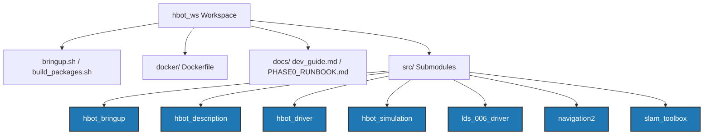

# Workspace Overview: HBOT AMR Platform

This document provides a comprehensive breakdown of the `hbot_ws` ROS 2 workspace. It outlines the architectural components, package roles, mechanical configuration of the robot, and launch pipeline logic.

---

## 🏗️ Repository Architecture

The workspace is organized as a main repository containing utility scripts, Docker build recipes, documentation, and a series of Git submodules located under the `src` folder.



---

## 📦 Package Directory & Roles

Under the `src/` directory, the following ROS 2 packages are configured as submodules:

### 1. [hbot_bringup](file:///home/huy/Documents/03.MyProjects/hbot_ws/src/hbot_bringup)
* **Role**: The central orchestration package.
* **Key Files**:
  * [hbot_bringup.launch.py](file:///home/huy/Documents/03.MyProjects/hbot_ws/src/hbot_bringup/launch/hbot_bringup.launch.py): The main entry launch file handling arguments for simulation/real hardware, mapping, navigation, and localization.
  * `config/`: Contains YAML parameters for navigation (`nav2_params.yaml`), SLAM (`slam_params.yaml`), and the serial driver (`yahboom_driver_params.yaml`).

### 2. [hbot_description](file:///home/huy/Documents/03.MyProjects/hbot_ws/src/hbot_description)
* **Role**: Defines the mechanical and physical properties of the robot.
* **Key Files**:
  * [hbot.urdf.xacro](file:///home/huy/Documents/03.MyProjects/hbot_ws/src/hbot_description/urdf/hbot.urdf.xacro): The primary parameterised Xacro file.
  * `CMakeLists.txt`: Instructs the build process to automatically compile the Xacro into `hbot.urdf` and export the Gazebo-compatible `hbot.sdf`.

### 3. [hbot_driver](file:///home/huy/Documents/03.MyProjects/hbot_ws/src/hbot_driver)
* **Role**: High-level hardware interfacing.
* **Key Files**:
  * [hbot_driver_yahboom.py](file:///home/huy/Documents/03.MyProjects/hbot_ws/src/hbot_driver/hbot_driver_yahboom/hbot_driver_yahboom.py): Subscribes to `cmd_vel`, translates linear/angular velocity to wheel commands (PWM) via serial communication with the Yahboom Rosmaster board, and publishes odometry, battery status, and optional IMU telemetry.
  * `Rosmaster_Lib/`: Underlying python library for low-level serial communication with the Yahboom controller board.

### 4. [hbot_simulation](file:///home/huy/Documents/03.MyProjects/hbot_ws/src/hbot_simulation)
* **Role**: Simulation environment.
* **Key Files**:
  * [hbot_house.launch.py](file:///home/huy/Documents/03.MyProjects/hbot_ws/src/hbot_simulation/launch/hbot_house.launch.py): Launches Gazebo, loads a virtual indoor environment (`hbot_house.world`), and spawns the robot description.

### 5. [lds_006_driver](file:///home/huy/Documents/03.MyProjects/hbot_ws/src/lds_006_driver)
* **Role**: Driver node for the physical LDS-006 LiDAR sensor.
* **Key Files**:
  * `src/lds006_laser_publisher.cpp`: Interfaces with the serial LiDAR stream and publishes `sensor_msgs/LaserScan` messages on the `/scan` topic.

### 6. [navigation2](file:///home/huy/Documents/03.MyProjects/hbot_ws/src/navigation2) & [slam_toolbox](file:///home/huy/Documents/03.MyProjects/hbot_ws/src/slam_toolbox)
* **Role**: Standard localization, mapping, and path planning components customized or referenced for this robot.

---

## 🤖 Robot Specifications (Mechanical & Kinematics)

From [hbot.urdf.xacro](file:///home/huy/Documents/03.MyProjects/hbot_ws/src/hbot_description/urdf/hbot.urdf.xacro) and [yahboom_driver_params.yaml](file:///home/huy/Documents/03.MyProjects/hbot_ws/src/hbot_bringup/config/yahboom_driver_params.yaml):

* **Type**: Differential Drive Robot
* **Dimensions**: Length: `0.17m`, Width: `0.14m`, Height: `0.12m`.
* **Wheels**:
  * **Diameter**: `0.065m` (radius `0.0325m`).
  * **Track Width / Separation**: `0.17m` (defined as `base_width + 2 * wheel_ygap`).
  * **Encoder Resolution**: `11` PPR, Gear Ratio: `56:1`. Total encoder ticks per rotation = `11 * 56 * 4 = 2464` ticks.
* **Lidar Sensor**:
  * **Mounting**: Mounted `0.075m` above the base center.
  * **Orientation**: Flipped 180 degrees (`rpy="0 0 3.14"`).

---

## 🚀 Operations & Orchestration Pipeline

### 🔄 Build Script (`build_packages.sh`)
Forces the system's python executable (`/usr/bin/python3`) and environment configs to avoid conflicts with virtual/conda environment python installations when invoking `colcon build`.

### 🚀 Bringup Script (`bringup.sh`)
Wraps the `ros2 launch hbot_bringup hbot_bringup.launch.py` command, sourcing the installation space and pre-defining environmental configurations like `ROS_DOMAIN_ID=9` and `CONTROLLER=yahboom`.

### 🗺️ Operational Modes matrix

```
                 +-------------------+
                 |    bringup.sh     |
                 +---------+---------+
                           |
            +--------------+--------------+
            |                             |
  [simulation_mode:=True]       [simulation_mode:=False]
            |                             |
     (Gazebo simulation)        (Real Yahboom HW & LiDAR)
            |                             |
      +-----+-----+                 +-----+-----+
      |           |                 |           |
  [slam:=T]   [slam:=F]         [slam:=T]   [slam:=F]
      |           |                 |           |
  SLAM/Map    Nav2 Map-based    SLAM/Map    Nav2 Map-based
  Building    Localization      Building    Localization
```
